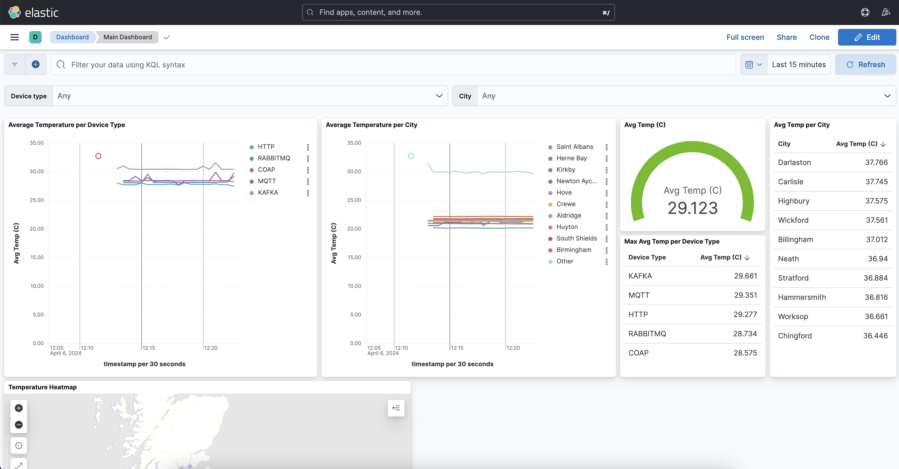
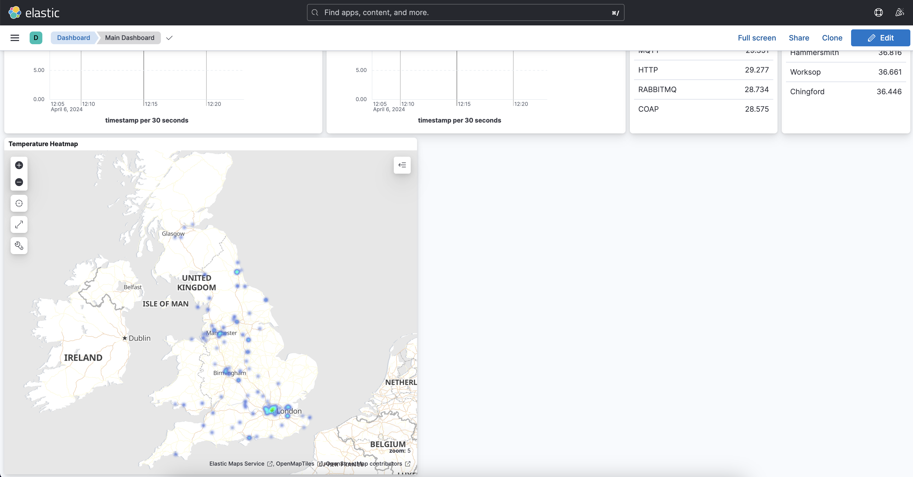
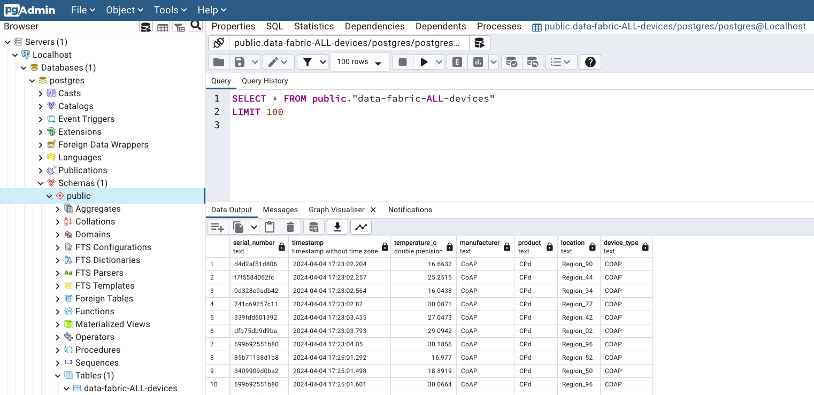

# data-fabric-iot-kafka
THIS IS A WORKING IN PROGRESS! Its is not ready yet.

Demo is composed of:
* [PostgreSQL](https://www.postgresql.org/) database
* [pgAdmin](https://www.pgadmin.org/) to access the PostgreSQL database
* Data Streaming Platform ([Confluent Platform](https://docs.confluent.io/platform/current/platform.html))
* [Schema Registry](https://docs.confluent.io/platform/current/schema-registry/index.html)
* [Confluent Control Center](https://docs.confluent.io/platform/current/control-center/index.html)
* [ksqlDB](https://docs.confluent.io/platform/current/ksqldb/index.html) cluster to process the data received by the source connector
* [Connect cluster](https://docs.confluent.io/platform/current/connect/userguide.html)
* [Elasticsearch](https://www.elastic.co/elasticsearch)
* [Kibana](https://www.elastic.co/kibana)
* Connectors:
  * [Syslog Source Connector for Confluent Platform](https://docs.confluent.io/kafka-connectors/syslog/current/overview.html)
  * [MQTT Source Connector for Confluent Platform](https://docs.confluent.io/kafka-connectors/mqtt/current/mqtt-source-connector/overview.html)
  * [RabbitMQ Source Connector for Confluent Platform](https://docs.confluent.io/kafka-connectors/rabbitmq-source/current/overview.html)
  * [Spool Dir Connectors for Confluent Platform](https://docs.confluent.io/kafka-connectors/spooldir/current/overview.html)
  * [Elasticsearch Service Sink Connector for Confluent Platform](https://docs.confluent.io/kafka-connectors/elasticsearch/current/overview.html)
  * [JDBC Sink Connector for Confluent Platform](https://docs.confluent.io/kafka-connectors/jdbc/current/sink-connector/overview.html)

## Software Requirements
* [curl](https://curl.se/)
* [Docker Desktop](https://www.docker.com/products/docker-desktop/)
* [Python 3.8+](https://www.python.org/)

### Python libs and virtual environment
* Clone this repo: `git clone git@github.com:ifnesi/data-fabric-iot-kafka`
* Go to the demo folder: `cd data-fabric-iot-kafka`
* Create a Python virtual environment: `python3 -m venv .venv`
* Activate the Python virtual environment: `source .venv/bin/activate`
* Install the python requirements: `python3 -m pip install -r requirements.txt`
* Deactivate the Python virtual environment: `deactivate`

### Demo Diagram and how it works






## Running the demo
To start the demo, please run `./start.sh`, after downloading all docker images it should take less than 2 minutes to have everything up and running.

Output example:
```
[start] 2024-04-06 09:48:59.000 [INFO]: Killing processes
[start] 2024-04-06 09:48:59.000 [INFO]: Loading environment variables
[start] 2024-04-06 09:48:59.000 [INFO]: Starting docker compose
[+] Running 15/16
 ⠙ Network data-fabric-iot-kafka_default        Created
 ✔ Container elasticsearch                      Started
 ✔ Container data-fabric-iot-kafka-rabbitmq-1   Started
 ✔ Container zookeeper                          Started
 ✔ Container mosquitto                          Started
 ✔ Container postgres                           Started
 ✔ Container kibana                             Started
 ✔ Container pgadmin                            Started
 ✔ Container broker                             Started
 ✔ Container schema-registry                    Started
 ✔ Container data-fabric-iot-kafka-connect-2-1  Started
 ✔ Container ksqldb-server                      Started
 ✔ Container data-fabric-iot-kafka-connect-1-1  Started
 ✔ Container rest-proxy                         Started
 ✔ Container ksqldb-cli                         Started
 ✔ Container control-center                     Started
[start] 2024-04-06 09:49:01.000 [INFO]: Waiting Schema Registry to be ready......................
[start] 2024-04-06 09:49:25.000 [INFO]: Waiting ksqlDB Cluster to be ready.
[start] 2024-04-06 09:49:26.000 [INFO]: Waiting Connect Cluster #1 to be ready....................................
[start] 2024-04-06 09:50:03.000 [INFO]: Waiting Connect Cluster #2 to be ready
[start] 2024-04-06 09:50:03.000 [INFO]: Waiting Confluent Control Center to be ready
[start] 2024-04-06 09:50:03.000 [INFO]: Activating Virtual Environment / installing Python requirements
Requirement already satisfied: aiocoap==0.4.7 in ./.venv/lib/python3.12/site-packages (from -r requirements.txt (line 1)) (0.4.7)
Requirement already satisfied: cefevent==0.5.6 in ./.venv/lib/python3.12/site-packages (from -r requirements.txt (line 2)) (0.5.6)
Requirement already satisfied: confluent-kafka==2.3.0 in ./.venv/lib/python3.12/site-packages (from -r requirements.txt (line 3)) (2.3.0)
Requirement already satisfied: fastavro==1.9.4 in ./.venv/lib/python3.12/site-packages (from -r requirements.txt (line 4)) (1.9.4)
Requirement already satisfied: paho_mqtt==2.0.0 in ./.venv/lib/python3.12/site-packages (from -r requirements.txt (line 5)) (2.0.0)
Requirement already satisfied: pika==1.3.2 in ./.venv/lib/python3.12/site-packages (from -r requirements.txt (line 6)) (1.3.2)
Requirement already satisfied: pysyslogclient==0.1.1 in ./.venv/lib/python3.12/site-packages (from -r requirements.txt (line 7)) (0.1.1)
Requirement already satisfied: python-dotenv==1.0.1 in ./.venv/lib/python3.12/site-packages (from -r requirements.txt (line 8)) (1.0.1)
Requirement already satisfied: requests==2.31.0 in ./.venv/lib/python3.12/site-packages (from -r requirements.txt (line 9)) (2.31.0)
Requirement already satisfied: charset-normalizer<4,>=2 in ./.venv/lib/python3.12/site-packages (from requests==2.31.0->-r requirements.txt (line 9)) (3.3.2)
Requirement already satisfied: idna<4,>=2.5 in ./.venv/lib/python3.12/site-packages (from requests==2.31.0->-r requirements.txt (line 9)) (3.6)
Requirement already satisfied: urllib3<3,>=1.21.1 in ./.venv/lib/python3.12/site-packages (from requests==2.31.0->-r requirements.txt (line 9)) (2.2.1)
Requirement already satisfied: certifi>=2017.4.17 in ./.venv/lib/python3.12/site-packages (from requests==2.31.0->-r requirements.txt (line 9)) (2024.2.2)
[start] 2024-04-06 09:50:05.000 [INFO]: Starting Kafka IoT device
[start] 2024-04-06 09:50:05.000 [INFO]: Starting HTTP IoT device
[start] 2024-04-06 09:50:05.000 [INFO]: Starting Syslog Connector
HTTP/1.1 201 Created
Date: Sat, 06 Apr 2024 08:50:05 GMT
Location: http://localhost:8083/connectors/syslog_source
Content-Type: application/json
Content-Length: 387

{"name":"syslog_source","config":{"connector.class":"io.confluent.connect.syslog.SyslogSourceConnector","syslog.port":"1514","syslog.listener":"TCP","syslog.listen.address":"0.0.0.0","topic":"data-fabric-syslog-devices","syslog.queue.batch.size":"100","syslog.queue.max.size":"100","syslog.write.timeout.millis":"10000","tasks.max":"1","name":"syslog_source"},"tasks":[],"type":"source"}
{"name":"syslog_source","connector":{"state":"RUNNING","worker_id":"connect-1:8083"},"tasks":[{"id":0,"state":"RUNNING","worker_id":"connect-1:8083"}],"type":"source"}
[start] 2024-04-06 09:50:11.000 [INFO]: Starting SysLog IoT device
[start] 2024-04-06 09:50:11.000 [INFO]: Starting Spooldir Connector
HTTP/1.1 201 Created
Date: Sat, 06 Apr 2024 08:50:11 GMT
Location: http://localhost:18083/connectors/spooldir_source
Content-Type: application/json
Content-Length: 601

{"name":"spooldir_source","config":{"connector.class":"com.github.jcustenborder.kafka.connect.spooldir.SpoolDirSchemaLessJsonSourceConnector","tasks.max":"1","key.converter":"org.apache.kafka.connect.storage.StringConverter","value.converter":"org.apache.kafka.connect.storage.StringConverter","topic":"data-fabric-coap-devices","input.path":"/tmp/coap-data","finished.path":"/tmp/coap-data/finished","error.path":"/tmp/coap-data/error","input.file.pattern":"telemetry.[0-9]{4}-[0-9]{2}-[0-9]{2}_[0-9]{2}-[0-9]{2}-[0-9]{2}","halt.on.error":"false","name":"spooldir_source"},"tasks":[],"type":"source"}
{"name":"spooldir_source","connector":{"state":"RUNNING","worker_id":"connect-2:8083"},"tasks":[{"id":0,"state":"RUNNING","worker_id":"connect-2:8083"}],"type":"source"}
[start] 2024-04-06 09:50:17.000 [INFO]: Starting CoAP Server
[start] 2024-04-06 09:50:19.000 [INFO]: Starting CoAP IoT device
[start] 2024-04-06 09:50:19.000 [INFO]: Starting MQTT Connector
HTTP/1.1 201 Created
Date: Sat, 06 Apr 2024 08:50:19 GMT
Location: http://localhost:8083/connectors/mqtt_source
Content-Type: application/json
Content-Length: 275

{"name":"mqtt_source","config":{"connector.class":"io.confluent.connect.mqtt.MqttSourceConnector","mqtt.server.uri":"tcp://mosquitto:1883","mqtt.topics":"python/mqtt/#","kafka.topic":"data-fabric-mqtt-devices","tasks.max":"1","name":"mqtt_source"},"tasks":[],"type":"source"}
{"name":"mqtt_source","connector":{"state":"RUNNING","worker_id":"connect-1:8083"},"tasks":[{"id":0,"state":"RUNNING","worker_id":"connect-1:8083"}],"type":"source"}
[start] 2024-04-06 09:50:26.000 [INFO]: Starting MQTT IoT device
[start] 2024-04-06 09:50:26.000 [INFO]: Starting RabbitMQ IoT device
[start] 2024-04-06 09:50:29.000 [INFO]: Starting RabbitMQ Connector
HTTP/1.1 201 Created
Date: Sat, 06 Apr 2024 08:50:29 GMT
Location: http://localhost:8083/connectors/rabbitmq_source
Content-Type: application/json
Content-Length: 306

{"name":"rabbitmq_source","config":{"connector.class":"io.confluent.connect.rabbitmq.RabbitMQSourceConnector","rabbitmq.host":"rabbitmq","rabbitmq.port":"5672","rabbitmq.queue":"iot-rabbitmq","kafka.topic":"data-fabric-rabbitmq-devices","tasks.max":"1","name":"rabbitmq_source"},"tasks":[],"type":"source"}
{"name":"rabbitmq_source","connector":{"state":"RUNNING","worker_id":"connect-1:8083"},"tasks":[{"id":0,"state":"RUNNING","worker_id":"connect-1:8083"}],"type":"source"}
[start] 2024-04-06 09:50:35.000 [INFO]: Submitting ksqlDB statements
[ksqldb_provisioning] 2024-04-06 09:50:45.595 [INFO]: Submitting ksqlDB statements

[ksqldb_provisioning] 2024-04-06 09:50:45.596 [INFO]: ksqldb/statement_001.sql:
CREATE STREAM IF NOT EXISTS `data-fabric-ALL-devices` ( `id` VARCHAR KEY, `serial_number` VARCHAR, `timestamp` TIMESTAMP, `temperature_c` DOUBLE, `manufacturer` VARCHAR, `product` VARCHAR, `city` VARCHAR, `device_type` VARCHAR, `location` VARCHAR ) WITH ( KAFKA_TOPIC = 'data-fabric-ALL-devices', PARTITIONS=1, KEY_FORMAT = 'KAFKA', VALUE_FORMAT = 'AVRO' );

[ksqldb_provisioning] 2024-04-06 09:50:45.971 [INFO]: Response [200]:
[
   {
      "@type": "currentStatus",
      "statementText": "CREATE STREAM IF NOT EXISTS `data-fabric-ALL-devices` (`id` STRING KEY, `serial_number` STRING, `timestamp` TIMESTAMP, `temperature_c` DOUBLE, `manufacturer` STRING, `product` STRING, `city` STRING, `device_type` STRING, `location` STRING) WITH (CLEANUP_POLICY='delete', KAFKA_TOPIC='data-fabric-ALL-devices', KEY_FORMAT='KAFKA', PARTITIONS=1, VALUE_FORMAT='AVRO');",
      "commandId": "stream/`data-fabric-ALL-devices`/create",
      "commandStatus": {
         "status": "SUCCESS",
         "message": "Stream created",
         "queryId": null
      },
      "commandSequenceNumber": 2,
      "warnings": []
   }
]

[ksqldb_provisioning] 2024-04-06 09:50:50.977 [INFO]: ksqldb/statement_002.sql:
CREATE STREAM IF NOT EXISTS `data-fabric-coap-devices` ( `timestamp` TIMESTAMP, `tmp` DOUBLE, `manufacturer` VARCHAR, `family` VARCHAR, `pos` VARCHAR, `sn` VARCHAR, `lat` DOUBLE, `long` DOUBLE ) WITH ( KAFKA_TOPIC = 'data-fabric-coap-devices', VALUE_FORMAT = 'JSON' );

[ksqldb_provisioning] 2024-04-06 09:50:51.172 [INFO]: Response [200]:
[
   {
      "@type": "currentStatus",
      "statementText": "CREATE STREAM IF NOT EXISTS `data-fabric-coap-devices` (`timestamp` TIMESTAMP, `tmp` DOUBLE, `manufacturer` STRING, `family` STRING, `pos` STRING, `sn` STRING, `lat` DOUBLE, `long` DOUBLE) WITH (CLEANUP_POLICY='delete', KAFKA_TOPIC='data-fabric-coap-devices', KEY_FORMAT='KAFKA', VALUE_FORMAT='JSON');",
      "commandId": "stream/`data-fabric-coap-devices`/create",
      "commandStatus": {
         "status": "SUCCESS",
         "message": "Stream created",
         "queryId": null
      },
      "commandSequenceNumber": 4,
      "warnings": []
   }
]

[ksqldb_provisioning] 2024-04-06 09:50:56.176 [INFO]: ksqldb/statement_003.sql:
INSERT INTO `data-fabric-ALL-devices` SELECT `sn` AS `id`, AS_VALUE(`sn`) AS `serial_number`, `timestamp` AS `timestamp`, `tmp` AS `temperature_c`, `manufacturer` AS `manufacturer`, `family` AS `product`, `pos` AS `city`, 'COAP' AS `device_type`, CAST(`lat` AS VARCHAR) + ',' + CAST(`long` AS VARCHAR) AS `location` FROM `data-fabric-coap-devices` PARTITION BY `sn`;

[ksqldb_provisioning] 2024-04-06 09:50:57.040 [INFO]: Response [200]:
[
   {
      "@type": "currentStatus",
      "statementText": "INSERT INTO `data-fabric-ALL-devices` SELECT `sn` AS `id`, AS_VALUE(`sn`) AS `serial_number`, `timestamp` AS `timestamp`, `tmp` AS `temperature_c`, `manufacturer` AS `manufacturer`, `family` AS `product`, `pos` AS `city`, 'COAP' AS `device_type`, CAST(`lat` AS VARCHAR) + ',' + CAST(`long` AS VARCHAR) AS `location` FROM `data-fabric-coap-devices` PARTITION BY `sn`;",
      "commandId": "stream/`data-fabric-ALL-devices`/create",
      "commandStatus": {
         "status": "SUCCESS",
         "message": "Created query with ID INSERTQUERY_5",
         "queryId": "INSERTQUERY_5"
      },
      "commandSequenceNumber": 6,
      "warnings": []
   }
]

[ksqldb_provisioning] 2024-04-06 09:51:02.042 [INFO]: ksqldb/statement_004.sql:
CREATE STREAM IF NOT EXISTS `data-fabric-http-devices` ( `tm` TIMESTAMP, `temp` DOUBLE, `mnf` VARCHAR, `prd` VARCHAR, `loc` VARCHAR, `sn` VARCHAR, `lt` DOUBLE, `lg` DOUBLE ) WITH ( KAFKA_TOPIC = 'data-fabric-http-devices', VALUE_FORMAT = 'JSON' );

[ksqldb_provisioning] 2024-04-06 09:51:02.250 [INFO]: Response [200]:
[
   {
      "@type": "currentStatus",
      "statementText": "CREATE STREAM IF NOT EXISTS `data-fabric-http-devices` (`tm` TIMESTAMP, `temp` DOUBLE, `mnf` STRING, `prd` STRING, `loc` STRING, `sn` STRING, `lt` DOUBLE, `lg` DOUBLE) WITH (CLEANUP_POLICY='delete', KAFKA_TOPIC='data-fabric-http-devices', KEY_FORMAT='KAFKA', VALUE_FORMAT='JSON');",
      "commandId": "stream/`data-fabric-http-devices`/create",
      "commandStatus": {
         "status": "SUCCESS",
         "message": "Stream created",
         "queryId": null
      },
      "commandSequenceNumber": 8,
      "warnings": []
   }
]

[ksqldb_provisioning] 2024-04-06 09:51:07.256 [INFO]: ksqldb/statement_005.sql:
INSERT INTO `data-fabric-ALL-devices` SELECT `sn` AS `id`, AS_VALUE(`sn`) AS `serial_number`, `tm` AS `timestamp`, `temp` AS `temperature_c`, `mnf` AS `manufacturer`, `prd` AS `product`, `loc` AS `city`, 'HTTP' AS `device_type`, CAST(`lt` AS VARCHAR) + ',' + CAST(`lg` AS VARCHAR) AS `location` FROM `data-fabric-http-devices` PARTITION BY `sn`;

[ksqldb_provisioning] 2024-04-06 09:51:07.661 [INFO]: Response [200]:
[
   {
      "@type": "currentStatus",
      "statementText": "INSERT INTO `data-fabric-ALL-devices` SELECT `sn` AS `id`, AS_VALUE(`sn`) AS `serial_number`, `tm` AS `timestamp`, `temp` AS `temperature_c`, `mnf` AS `manufacturer`, `prd` AS `product`, `loc` AS `city`, 'HTTP' AS `device_type`, CAST(`lt` AS VARCHAR) + ',' + CAST(`lg` AS VARCHAR) AS `location` FROM `data-fabric-http-devices` PARTITION BY `sn`;",
      "commandId": "stream/`data-fabric-ALL-devices`/create",
      "commandStatus": {
         "status": "SUCCESS",
         "message": "Created query with ID INSERTQUERY_9",
         "queryId": "INSERTQUERY_9"
      },
      "commandSequenceNumber": 10,
      "warnings": []
   }
]

[ksqldb_provisioning] 2024-04-06 09:51:12.667 [INFO]: ksqldb/statement_006.sql:
CREATE STREAM IF NOT EXISTS `data-fabric-mqtt-devices` ( `key` VARCHAR KEY, `payload` VARCHAR ) WITH ( KAFKA_TOPIC = 'data-fabric-mqtt-devices', VALUE_FORMAT = 'KAFKA' );

[ksqldb_provisioning] 2024-04-06 09:51:12.873 [INFO]: Response [200]:
[
   {
      "@type": "currentStatus",
      "statementText": "CREATE STREAM IF NOT EXISTS `data-fabric-mqtt-devices` (`key` STRING KEY, `payload` STRING) WITH (CLEANUP_POLICY='delete', KAFKA_TOPIC='data-fabric-mqtt-devices', KEY_FORMAT='KAFKA', VALUE_FORMAT='KAFKA');",
      "commandId": "stream/`data-fabric-mqtt-devices`/create",
      "commandStatus": {
         "status": "SUCCESS",
         "message": "Stream created",
         "queryId": null
      },
      "commandSequenceNumber": 12,
      "warnings": []
   }
]

[ksqldb_provisioning] 2024-04-06 09:51:17.881 [INFO]: ksqldb/statement_007.sql:
INSERT INTO `data-fabric-ALL-devices` SELECT SPLIT(`key`, '/')[5] AS `id`, AS_VALUE(SPLIT(`key`, '/')[5]) AS `serial_number`, PARSE_TIMESTAMP(EXTRACTJSONFIELD(SUBSTRING(`payload`, 6, LEN(`payload`)), '$.epoch'), 'yyyy-MM-dd HH:mm:ss.SSSSSS') AS `timestamp`, (CAST(EXTRACTJSONFIELD(SUBSTRING(`payload`, 6, LEN(`payload`)), '$.temperature') AS DOUBLE) - 32) * 5/9 AS `temperature_c`, SPLIT(`key`, '/')[3] AS `manufacturer`, SPLIT(`key`, '/')[4] AS `product`, EXTRACTJSONFIELD(SUBSTRING(`payload`, 6, LEN(`payload`)), '$.location') AS `city`, 'MQTT' AS `device_type`, EXTRACTJSONFIELD(SUBSTRING(`payload`, 6, LEN(`payload`)), '$.latitude') + ',' + EXTRACTJSONFIELD(SUBSTRING(`payload`, 6, LEN(`payload`)), '$.longitude') AS `location` FROM `data-fabric-mqtt-devices` PARTITION BY SPLIT(`key`, '/')[5];

[ksqldb_provisioning] 2024-04-06 09:51:18.406 [INFO]: Response [200]:
[
   {
      "@type": "currentStatus",
      "statementText": "INSERT INTO `data-fabric-ALL-devices` SELECT SPLIT(`key`, '/')[5] AS `id`, AS_VALUE(SPLIT(`key`, '/')[5]) AS `serial_number`, PARSE_TIMESTAMP(EXTRACTJSONFIELD(SUBSTRING(`payload`, 6, LEN(`payload`)), '$.epoch'), 'yyyy-MM-dd HH:mm:ss.SSSSSS') AS `timestamp`, (CAST(EXTRACTJSONFIELD(SUBSTRING(`payload`, 6, LEN(`payload`)), '$.temperature') AS DOUBLE) - 32) * 5/9 AS `temperature_c`, SPLIT(`key`, '/')[3] AS `manufacturer`, SPLIT(`key`, '/')[4] AS `product`, EXTRACTJSONFIELD(SUBSTRING(`payload`, 6, LEN(`payload`)), '$.location') AS `city`, 'MQTT' AS `device_type`, EXTRACTJSONFIELD(SUBSTRING(`payload`, 6, LEN(`payload`)), '$.latitude') + ',' + EXTRACTJSONFIELD(SUBSTRING(`payload`, 6, LEN(`payload`)), '$.longitude') AS `location` FROM `data-fabric-mqtt-devices` PARTITION BY SPLIT(`key`, '/')[5];",
      "commandId": "stream/`data-fabric-ALL-devices`/create",
      "commandStatus": {
         "status": "SUCCESS",
         "message": "Created query with ID INSERTQUERY_13",
         "queryId": "INSERTQUERY_13"
      },
      "commandSequenceNumber": 14,
      "warnings": []
   }
]

[ksqldb_provisioning] 2024-04-06 09:51:23.407 [INFO]: ksqldb/statement_008.sql:
CREATE STREAM IF NOT EXISTS `data-fabric-rabbitmq-devices` ( `payload` VARCHAR ) WITH ( KAFKA_TOPIC = 'data-fabric-rabbitmq-devices', VALUE_FORMAT = 'KAFKA' );

[ksqldb_provisioning] 2024-04-06 09:51:23.596 [INFO]: Response [200]:
[
   {
      "@type": "currentStatus",
      "statementText": "CREATE STREAM IF NOT EXISTS `data-fabric-rabbitmq-devices` (`payload` STRING) WITH (CLEANUP_POLICY='delete', KAFKA_TOPIC='data-fabric-rabbitmq-devices', KEY_FORMAT='KAFKA', VALUE_FORMAT='KAFKA');",
      "commandId": "stream/`data-fabric-rabbitmq-devices`/create",
      "commandStatus": {
         "status": "SUCCESS",
         "message": "Stream created",
         "queryId": null
      },
      "commandSequenceNumber": 16,
      "warnings": []
   }
]

[ksqldb_provisioning] 2024-04-06 09:51:28.602 [INFO]: ksqldb/statement_009.sql:
INSERT INTO `data-fabric-ALL-devices` SELECT EXTRACTJSONFIELD(SUBSTRING(`payload`, 6, LEN(`payload`)), '$.serno') AS `id`, AS_VALUE(EXTRACTJSONFIELD(SUBSTRING(`payload`, 6, LEN(`payload`)), '$.serno')) AS `serial_number`, PARSE_TIMESTAMP(EXTRACTJSONFIELD(SUBSTRING(`payload`, 6, LEN(`payload`)), '$.timestamp'), 'yyyy-MM-dd HH:mm:ss.SSSSSS') AS `timestamp`, CAST(EXTRACTJSONFIELD(SUBSTRING(`payload`, 6, LEN(`payload`)), '$.temp') AS DOUBLE) AS `temperature_c`, EXTRACTJSONFIELD(SUBSTRING(`payload`, 6, LEN(`payload`)), '$.provider') AS `manufacturer`, EXTRACTJSONFIELD(SUBSTRING(`payload`, 6, LEN(`payload`)), '$.product') AS `product`,EXTRACTJSONFIELD(SUBSTRING(`payload`, 6, LEN(`payload`)), '$.region') AS `city`, 'RABBITMQ' AS `device_type`, EXTRACTJSONFIELD(SUBSTRING(`payload`, 6, LEN(`payload`)), '$.lat') + ',' + EXTRACTJSONFIELD(SUBSTRING(`payload`, 6, LEN(`payload`)), '$.lon') AS `location` FROM `data-fabric-rabbitmq-devices` PARTITION BY EXTRACTJSONFIELD(SUBSTRING(`payload`, 6, LEN(`payload`)), '$.serno');

[ksqldb_provisioning] 2024-04-06 09:51:29.057 [INFO]: Response [200]:
[
   {
      "@type": "currentStatus",
      "statementText": "INSERT INTO `data-fabric-ALL-devices` SELECT EXTRACTJSONFIELD(SUBSTRING(`payload`, 6, LEN(`payload`)), '$.serno') AS `id`, AS_VALUE(EXTRACTJSONFIELD(SUBSTRING(`payload`, 6, LEN(`payload`)), '$.serno')) AS `serial_number`, PARSE_TIMESTAMP(EXTRACTJSONFIELD(SUBSTRING(`payload`, 6, LEN(`payload`)), '$.timestamp'), 'yyyy-MM-dd HH:mm:ss.SSSSSS') AS `timestamp`, CAST(EXTRACTJSONFIELD(SUBSTRING(`payload`, 6, LEN(`payload`)), '$.temp') AS DOUBLE) AS `temperature_c`, EXTRACTJSONFIELD(SUBSTRING(`payload`, 6, LEN(`payload`)), '$.provider') AS `manufacturer`, EXTRACTJSONFIELD(SUBSTRING(`payload`, 6, LEN(`payload`)), '$.product') AS `product`,EXTRACTJSONFIELD(SUBSTRING(`payload`, 6, LEN(`payload`)), '$.region') AS `city`, 'RABBITMQ' AS `device_type`, EXTRACTJSONFIELD(SUBSTRING(`payload`, 6, LEN(`payload`)), '$.lat') + ',' + EXTRACTJSONFIELD(SUBSTRING(`payload`, 6, LEN(`payload`)), '$.lon') AS `location` FROM `data-fabric-rabbitmq-devices` PARTITION BY EXTRACTJSONFIELD(SUBSTRING(`payload`, 6, LEN(`payload`)), '$.serno');",
      "commandId": "stream/`data-fabric-ALL-devices`/create",
      "commandStatus": {
         "status": "SUCCESS",
         "message": "Created query with ID INSERTQUERY_17",
         "queryId": "INSERTQUERY_17"
      },
      "commandSequenceNumber": 18,
      "warnings": []
   }
]

[ksqldb_provisioning] 2024-04-06 09:51:34.064 [INFO]: ksqldb/statement_010.sql:
CREATE STREAM IF NOT EXISTS `data-fabric-syslog-devices` ( `extension` MAP<VARCHAR, VARCHAR>, `deviceVendor` VARCHAR, `deviceProduct` VARCHAR, `deviceVersion` VARCHAR, `timestamp` TIMESTAMP ) WITH ( KAFKA_TOPIC = 'data-fabric-syslog-devices', VALUE_FORMAT = 'AVRO' );

[ksqldb_provisioning] 2024-04-06 09:51:34.294 [INFO]: Response [200]:
[
   {
      "@type": "currentStatus",
      "statementText": "CREATE STREAM IF NOT EXISTS `data-fabric-syslog-devices` (`extension` MAP<STRING, STRING>, `deviceVendor` STRING, `deviceProduct` STRING, `deviceVersion` STRING, `timestamp` TIMESTAMP) WITH (CLEANUP_POLICY='delete', KAFKA_TOPIC='data-fabric-syslog-devices', KEY_FORMAT='KAFKA', VALUE_FORMAT='AVRO');",
      "commandId": "stream/`data-fabric-syslog-devices`/create",
      "commandStatus": {
         "status": "SUCCESS",
         "message": "Stream created",
         "queryId": null
      },
      "commandSequenceNumber": 20,
      "warnings": []
   }
]

[ksqldb_provisioning] 2024-04-06 09:51:39.298 [INFO]: ksqldb/statement_011.sql:
INSERT INTO `data-fabric-ALL-devices` SELECT `deviceVersion` AS `id`, AS_VALUE(`deviceVersion`) AS `serial_number`, `timestamp` AS `timestamp`, CAST(`extension`['cfp1'] AS DOUBLE) AS `temperature_c`, `deviceVendor` AS `manufacturer`, `deviceProduct` AS `product`, `extension`['deviceDirection'] AS `city`, 'SYSLOG' AS `device_type`, `extension`['cfp2'] + ',' + `extension`['cfp3'] AS `location` FROM `data-fabric-syslog-devices` PARTITION BY `deviceVersion`;

[ksqldb_provisioning] 2024-04-06 09:51:39.654 [INFO]: Response [200]:
[
   {
      "@type": "currentStatus",
      "statementText": "INSERT INTO `data-fabric-ALL-devices` SELECT `deviceVersion` AS `id`, AS_VALUE(`deviceVersion`) AS `serial_number`, `timestamp` AS `timestamp`, CAST(`extension`['cfp1'] AS DOUBLE) AS `temperature_c`, `deviceVendor` AS `manufacturer`, `deviceProduct` AS `product`, `extension`['deviceDirection'] AS `city`, 'SYSLOG' AS `device_type`, `extension`['cfp2'] + ',' + `extension`['cfp3'] AS `location` FROM `data-fabric-syslog-devices` PARTITION BY `deviceVersion`;",
      "commandId": "stream/`data-fabric-ALL-devices`/create",
      "commandStatus": {
         "status": "SUCCESS",
         "message": "Created query with ID INSERTQUERY_21",
         "queryId": "INSERTQUERY_21"
      },
      "commandSequenceNumber": 22,
      "warnings": []
   }
]

[ksqldb_provisioning] 2024-04-06 09:51:44.659 [INFO]: ksqldb/statement_012.sql:
CREATE STREAM IF NOT EXISTS `data-fabric-kafka-devices` WITH ( KAFKA_TOPIC = 'data-fabric-kafka-devices', VALUE_FORMAT = 'AVRO' ); 

[ksqldb_provisioning] 2024-04-06 09:51:44.880 [INFO]: Response [200]:
[
   {
      "@type": "currentStatus",
      "statementText": "CREATE STREAM IF NOT EXISTS `data-fabric-kafka-devices` (DATETIME STRING, TEMPERATURE DOUBLE, MANUFACTURER STRING, PRODUCT STRING, REGION STRING, LAT DOUBLE, LNG DOUBLE, ID STRING) WITH (CLEANUP_POLICY='delete', KAFKA_TOPIC='data-fabric-kafka-devices', KEY_FORMAT='KAFKA', VALUE_FORMAT='AVRO');",
      "commandId": "stream/`data-fabric-kafka-devices`/create",
      "commandStatus": {
         "status": "SUCCESS",
         "message": "Stream created",
         "queryId": null
      },
      "commandSequenceNumber": 24,
      "warnings": []
   }
]

[ksqldb_provisioning] 2024-04-06 09:51:49.885 [INFO]: ksqldb/statement_013.sql:
INSERT INTO `data-fabric-ALL-devices` SELECT `ID` AS `id`, AS_VALUE(`ID`) AS `serial_number`, PARSE_TIMESTAMP(`DATETIME`, 'yyyy-MM-dd HH:mm:ss.SSSSSS') AS `timestamp`, `TEMPERATURE` AS `temperature_c`, `MANUFACTURER` AS `manufacturer`, `PRODUCT` AS `product`, `REGION` AS `city`, 'KAFKA' AS `device_type`, CAST(`LAT` AS VARCHAR) + ',' + CAST(`LNG` AS VARCHAR) AS `location` FROM `data-fabric-kafka-devices` PARTITION BY `ID`;

[ksqldb_provisioning] 2024-04-06 09:51:50.224 [INFO]: Response [200]:
[
   {
      "@type": "currentStatus",
      "statementText": "INSERT INTO `data-fabric-ALL-devices` SELECT `ID` AS `id`, AS_VALUE(`ID`) AS `serial_number`, PARSE_TIMESTAMP(`DATETIME`, 'yyyy-MM-dd HH:mm:ss.SSSSSS') AS `timestamp`, `TEMPERATURE` AS `temperature_c`, `MANUFACTURER` AS `manufacturer`, `PRODUCT` AS `product`, `REGION` AS `city`, 'KAFKA' AS `device_type`, CAST(`LAT` AS VARCHAR) + ',' + CAST(`LNG` AS VARCHAR) AS `location` FROM `data-fabric-kafka-devices` PARTITION BY `ID`;",
      "commandId": "stream/`data-fabric-ALL-devices`/create",
      "commandStatus": {
         "status": "SUCCESS",
         "message": "Created query with ID INSERTQUERY_25",
         "queryId": "INSERTQUERY_25"
      },
      "commandSequenceNumber": 26,
      "warnings": []
   }
]
[start] 2024-04-06 09:51:55.000 [INFO]: Starting Elastic Connector
HTTP/1.1 201 Created
Date: Sat, 06 Apr 2024 08:51:55 GMT
Location: http://localhost:8083/connectors/elastic_sink
Content-Type: application/json
Content-Length: 510

{"name":"elastic_sink","config":{"connector.class":"io.confluent.connect.elasticsearch.ElasticsearchSinkConnector","connection.url":"http://elasticsearch:9200","key.ignore":"true","topics":"data-fabric-ALL-devices","drop.invalid.message":"true","behavior.on.null.values":"IGNORE","behavior.on.malformed.documents":"ignore","write.method":"insert","data.stream.dataset":"iot","data.stream.type":"METRICS","data.stream.timestamp.field":"timestamp","tasks.max":"1","name":"elastic_sink"},"tasks":[],"type":"sink"}
{"name":"elastic_sink","connector":{"state":"RUNNING","worker_id":"connect-1:8083"},"tasks":[{"id":0,"state":"RUNNING","worker_id":"connect-1:8083"}],"type":"sink"}
[start] 2024-04-06 09:52:00.000 [INFO]: Starting Postgres Connector
HTTP/1.1 201 Created
Date: Sat, 06 Apr 2024 08:52:00 GMT
Location: http://localhost:8083/connectors/postgres_sink
Content-Type: application/json
Content-Length: 424

{"name":"postgres_sink","config":{"connector.class":"io.confluent.connect.jdbc.JdbcSinkConnector","topics":"data-fabric-ALL-devices","connection.url":"jdbc:postgresql://postgres:5432/postgres?verifyServerCertificate=false&useSSL=false&requireSSL=false","connection.user":"postgres","connection.password":"postgres","insert.mode":"insert","auto.create":"true","tasks.max":"1","name":"postgres_sink"},"tasks":[],"type":"sink"}
{"name":"postgres_sink","connector":{"state":"RUNNING","worker_id":"connect-1:8083"},"tasks":[{"id":0,"state":"RUNNING","worker_id":"connect-1:8083"}],"type":"sink"}
[start] 2024-04-06 09:52:05.000 [INFO]: Creating Kibana/Elastic Dashboard
{"successCount":2,"success":true,"warnings":[],"successResults":[{"type":"index-pattern","id":"eda0aa5f-b7bf-45c4-b8ad-496c0ec68123","meta":{"title":"Confluent Data Fabric","icon":"indexPatternApp"},"destinationId":"424af159-7fb9-4c12-a1c2-e23320573883"},{"type":"dashboard","id":"0317e4d0-f27f-11ee-aad1-9b25fa21227e","meta":{"title":"Main Dashboard","icon":"dashboardApp"},"destinationId":"33a1c386-e80a-4aa5-87a2-18382f186c0b"}]}

[start] 2024-04-06 09:52:16.000 [INFO]: Demo successfully started
```

## Stopping the demo
To stop the demo, please run `./stop.sh`.

Output example
```
[stop] 2024-04-06 09:46:55.000 [INFO]: Killing processes
[stop] 2024-04-06 09:46:55.000 [INFO]: Cleaning up old data files
[stop] 2024-04-06 09:46:55.000 [INFO]: Stopping docker compose
[+] Running 16/15
 ✔ Container ksqldb-cli                         Removed
 ✔ Container pgadmin                            Removed
 ✔ Container rest-proxy                         Removed
 ✔ Container data-fabric-iot-kafka-rabbitmq-1   Removed
 ✔ Container kibana                             Removed
 ✔ Container mosquitto                          Removed
 ✔ Container control-center                     Removed
 ✔ Container ksqldb-server                      Removed
 ✔ Container data-fabric-iot-kafka-connect-2-1  Removed
 ✔ Container data-fabric-iot-kafka-connect-1-1  Removed
 ✔ Container postgres                           Removed
 ✔ Container elasticsearch                      Removed
 ✔ Container schema-registry                    Removed
 ✔ Container broker                             Removed
 ✔ Container zookeeper                          Removed
 ✔ Network data-fabric-iot-kafka_default        Removed
[stop] 2024-04-06 09:47:19.000 [INFO]: Demo successfully stopped
```

## External References
Check out [Confluent's Developer portal](https://developer.confluent.io), it has free courses, documents, articles, blogs, podcasts and so many more content to get you up and running with a fully managed Apache Kafka service.

Disclaimer: I work for Confluent :wink:
