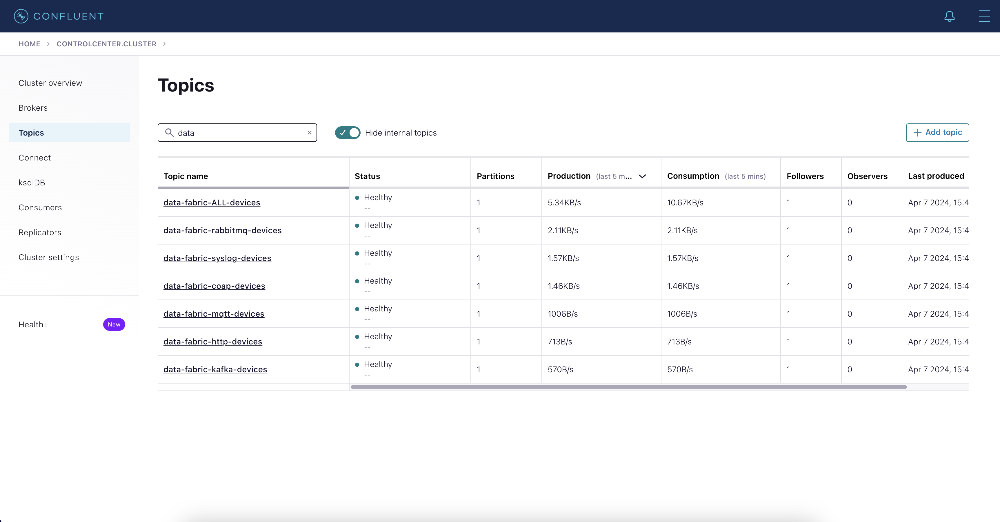

# data-fabric-iot-kafka
In this simple but comprehensive demo, Confluent Platform acts as true central nervous system, ingesting data from several edge devices. These devices send important information like temperature and GPS location, but they use many different communication and application protocols, such as [MQTT](https://en.wikipedia.org/wiki/MQTT), [HTTP](https://en.wikipedia.org/wiki/HTTP), [Kafka](https://en.wikipedia.org/wiki/Apache_Kafka), [CoAP](https://en.wikipedia.org/wiki/Constrained_Application_Protocol), [Syslog](https://en.wikipedia.org/wiki/Syslog), and [RabbitMQ](https://en.wikipedia.org/wiki/RabbitMQ) (just to name a few). This diversity reflects the IoT world's nature, where a single standard is more the exception than the norm, requiring a robust, highly scalable, and adaptable data streaming platform.

Confluent Platform stands out because it can take in data from all these different sources in real time, thanks to its wide range of connectors. Once the data arrives, it's transformed into a common format using ksqlDB, a tool for processing data streams. This makes the data easier to understand and use decoupling upstream applications. After processing, the data is sent to Elasticsearch, where it's displayed on a Kibana dashboard. This gives a clear view of the data in real time. The data is also saved in PostgresDB for later use. This demonstration underlines the Confluent Platform's strength as a data streaming backbone, capable of knitting together a complex tapestry of IoT devices and protocols into a cohesive and efficient data fabric architecture.

A data fabric is an integrated architecture and set of data services that provide consistent capabilities across a choice of endpoints spanning on-premises and multiple cloud environments. It facilitates the seamless integration, management, and analysis of data across different platforms, systems, and environments, enabling organizations to access and share their data more efficiently. By automating data discovery, governance, and management, a data fabric helps organizations to break down data silos, improve collaboration, and drive more informed decision-making. This architecture is particularly valuable in handling the complexities of big data, real-time analytics, and supporting data-driven applications, making it a foundational component for digital transformation initiatives.

Confluent Platform or Confluent Cloud is an excellent choice for a data fabric architecture due to its robust capabilities in data streaming and processing, which are crucial for creating a seamless and real-time data integration environment:
1. **Kafka Ecosystem**: Built on Apache Kafka, Confluent provides a high-throughput, scalable, and resilient messaging system that can handle the vast data flows typical in a data fabric architecture.
2. **Real-time Data Processing**: Confluent enables real-time data processing and analytics, allowing organizations to gain immediate insights and respond quickly to changing conditions.
3. **Unified Data Integration**: With a wide array of connectors and integrations, Confluent facilitates the unification of data from disparate sources and formats, crucial for the data fabric's goal of comprehensive data integration.
4. **Schema Management**: Confluent Schema Registry helps maintain consistent data formats and enforces compatibility rules, ensuring data integrity across the fabric.
5. **Security and Governance**: Confluent provides robust security features, including encryption, access control, and audit capabilities, essential for maintaining data privacy and compliance within a data fabric.
6. **Cloud-Native Support**: Confluent Cloud offers a fully managed service, which means organizations can leverage cloud-native benefits like scalability, resilience, and reduced operational overhead, making it easier to build and maintain a data fabric architecture.
7. **Ecosystem and Community Support**: Being a widely adopted platform, Confluent benefits from a large community and ecosystem, providing extensive resources, support, and innovation.

## Demo Diagram (Overview)


## Software Requirements
* [jq](https://jqlang.github.io/jq/)
* [curl](https://curl.se/)
* [Docker Desktop](https://www.docker.com/products/docker-desktop/)
* [Python 3.8+](https://www.python.org/)

## How it works
With exception of the python scripts emulating the edge devices, the demo runs all in Docker. Here are the components:
* Data Streaming Platform ([Confluent Platform](https://docs.confluent.io/platform/current/platform.html)): full-scale streaming service that enhances Apache Kafka with added tools and functionalities for real-time data processing and system management
* [Confluent Control Center](https://docs.confluent.io/platform/current/control-center/index.html): management and monitoring tool for overseeing Kafka, connect and ksqlDB clusters and the data flowing through them within the Confluent Platform, accessible through http://localhost:9021
* [Schema Registry](https://docs.confluent.io/platform/current/schema-registry/index.html): provides a centralized repository for storing and managing the schemas of Kafka topics, ensuring data consistency and compatibility across the system
* [ksqlDB](https://docs.confluent.io/platform/current/ksqldb/index.html): process in real-time the data received by the source connectors
* [Confluent Platform HTTP Rest Proxy](https://docs.confluent.io/platform/current/kafka-rest/index.html): provides a RESTful interface to a Kafka cluster, allowing you to produce and consume messages over HTTP, making Kafka accessible from any language that supports HTTP requests
* [Eclipse Mosquitto](https://mosquitto.org/): open-source message broker that implements the MQTT protocol, used for lightweight and efficient messaging in various IoT and real-time applications
* [Elasticsearch](https://www.elastic.co/elasticsearch): distributed, open-source search and analytics engine designed for horizontal scalability, reliability, and easy management, primarily used for full-text search, structured search, and analytics
* [Kibana](https://www.elastic.co/kibana): open-source data visualization dashboard for Elasticsearch, used for searching, viewing, and interacting with data stored in Elasticsearch indices through a variety of charts, tables, and maps, accessible through http://localhost:5601
* [PostgreSQL](https://www.postgresql.org/): open-source, advanced, object-relational database system known for its reliability, robustness, and performance, with strong support for extensibility and SQL standards compliance
* [pgAdmin](https://www.pgadmin.org/): open-source administration and development platform for PostgreSQL, providing a graphical interface to manage, maintain, and develop PostgreSQL databases, accessible through http://localhost:5050
* Confluent Source Connectors:
  * [Syslog Source Connector for Confluent Platform](https://docs.confluent.io/kafka-connectors/syslog/current/overview.html): acts as a Syslog server to receive data from the Syslog edge devices
  * [MQTT Source Connector for Confluent Platform](https://docs.confluent.io/kafka-connectors/mqtt/current/mqtt-source-connector/overview.html): connects to the MQTT broker subscribing to the topics published by the MQTT edge devices
  * [RabbitMQ Source Connector for Confluent Platform](https://docs.confluent.io/kafka-connectors/rabbitmq-source/current/overview.html): connects to the RabbitMQ broker subscribing to the queues published by the RabbitMQ edge devices
  * [Spool Dir Connectors for Confluent Platform](https://docs.confluent.io/kafka-connectors/spooldir/current/overview.html): processes all logs by the CoAP server
* Confluent Sink Connectors:
  * [Elasticsearch Service Sink Connector for Confluent Platform](https://docs.confluent.io/kafka-connectors/elasticsearch/current/overview.html)
  * [JDBC Sink Connector for Confluent Platform](https://docs.confluent.io/kafka-connectors/jdbc/current/sink-connector/overview.html)
* Python scripts:
  * `coap_server.py`: emulate a CoAP Server. All data transmitted by the CoAP devices (JSON) are logged into files under the folder `./coap-data/` to then be processed by the Spool Dir source connector
  * `iot_coap.py`: emulate edge devices transmitting data via CoAP:
  ```
   Value = {
      "timestamp": 1712403220046,  # EPOCH timestamp
      "tmp": 28.9552,              # Temperature in C
      "manufacturer": "CoAP",      # Device manufacturer name
      "family": "CPd",             # Device product family
      "pos": "Morley",             # Location of the device
      "lat": 53.7492,              # Latitude
      "long": -1.6023,             # Longitude
      "sn": "cb05503d6cdc"         # Device serial number
   }
  ```
  * `iot_http.py`: emulate edge devices transmitting data via HTTP to the Confluent Platform HTTP Rest Proxy:
  ```
   Value = {
      "tm": 1712402959641,      # EPOCH timestamp
      "temp": 36.8015,          # Temperature in C
      "mnf": "KafkaHttpTemp",   # Device manufacturer name
      "prd": "Kh1",             # Device product family
      "loc": "Hammersmith",     # Location of the device
      "lt": 51.4928,            # Latitude
      "lg": -0.2229,            # Longitude
      "sn": "e40b8dbd884e"      # Device serial number
   }
  ```
  * `iot_kafka.py`: emulate edge devices transmitting data directly to Confluent Platform using the Kafka protocol:
  ```
   Key = 22962b1b74aa                            # Device serial number
   Value = {
      "datetime": "2024-04-06 11:29:42.492824",  # Timestamp
      "temperature": 37.6163,                    # Temperature in C
      "manufacturer": "KafkaTemp",               # Device manufacturer name
      "product": "K1",                           # Device product family
      "region": "Highbury",                      # Location of the device
      "lat": 51.552,                             # Latitude
      "lng": -0.097,                             # Longitude
      "id": "22962b1b74aa"                       # Device serial number
   }
  ```
  * `iot_mqtt.py`: emulate edge devices transmitting data via the MQTT protocol:
  ```
   Topic = python/mqtt/PicoQ/Q1/ac1867dffb73  # python/mqtt/<Device manufacturer name>/<Device product family>/<Device serial number>
   Value = {
      "epoch": "2024-04-06 11:28:14.619587",  # Timestamp
      "temperature": 93.609,                  # Temperature in F 
      "location": "Rochester",                # Location of the device
      "latitude": 51.375,                     # Latitude
      "longitude": 0.5,                       # Longitude
      "unit": "F"                             # Unit of measurement
   }
  ```
  * `iot_rabbitmq.py`: emulate edge devices transmitting data via the RabbitMQ protocol:
  ```
   Value = {
      "timestamp": "2024-04-06 11:31:16.492909",  # Timestamp
      "temp": 18.1642,                            # Temperature in C
      "provider": "RMQ",                          # Device manufacturer name
      "product": "sx",                            # Device product family
      "region": "Saint Albans",                   # Location of the device
      "lat": 51.755,                              # Latitude
      "lon": -0.336,                              # Longitude
      "serno": "d45af1c720a1"                     # Device serial number
   }
  ```
  * `iot_syslog.py`: emulate edge devices transmitting data via Syslog (CEF format):
  ```
   Device Transmits data in this format:
      <13>Apr 06 12:27:15 P3W32CDKHC CEF:0|SysTemp|SysIotLog|c007cd785cf2|100|Telemetry|5|cfp1=36.6724 cfp1Label=C cfp2=51.623 cfp2Label=lat cfp3=0.009 cfp3Label=lon deviceDirection=Chingford
   The Syslog Source Connector have it converted to:
      {
      "name": {
         "string": "Telemetry"
      },
      "type": "CEF",
      "message": null,
      "host": {
         "string": "P3W32CDKHC"
      },
      "version": {
         "int": 0
      },
      "level": {
         "int": 5
      },
      "tag": null,
      "extension": {
         "map": {
            "cfp1": "36.6724",                # Temperature in C
            "cfp1Label": "C",                 # Unit of measurement
            "cfp2": "51.623",                 # Latitude
            "cfp2Label": "lat",
            "cfp3": "0.009",                  # Longitude
            "cfp3Label": "lon",
            "deviceDirection": "Chingford"    # Location of the device
         }
      },
      "severity": {
         "string": "5"
      },
      "appName": null,
      "facility": {
         "int": 1
      },
      "remoteAddress": {
         "string": "192.168.65.1"
      },
      "rawMessage": {
         "string": "<13>Apr 06 12:27:15 P3W32CDKHC CEF:0|SysTemp|SysIotLog|c007cd785cf2|100|Telemetry|5|cfp1=36.6724 cfp1Label=C cfp2=51.623 cfp2Label=lat cfp3=0.009 cfp3Label=lon deviceDirection=Chingford"
      },
      "processId": null,
      "messageId": null,
      "structuredData": null,
      "deviceVendor": {
         "string": "SysTemp"                  # Device manufacturer name
      },
      "deviceProduct": {
         "string": "SysIotLog"                # Device product family
      },
      "deviceVersion": {
         "string": "c007cd785cf2"             # Device serial number
      },
      "deviceEventClassId": {
         "string": "100"
      },
      "timestamp": {
         "long": 1712406435000                # EPOCH timestamp
      },
      "receivedDate": {
         "long": 1712402835031
      }
   }
  ```
  * `ksqldb_provisioning.py`: submit ksql statements to the ksqlDB cluster to normalize the data tramsitted byt he edge devices into a single structure (AVRO schema). For details about the ksql statements they are located under the folder `./ksqldb/`
  * `elastic_geopoint.py`: script to add a new field into the Elasticsearch table. Field name is `gps` data type `geo_point` containing the latitude and longitude as reported by the edge devices

### Diagram overview with the payload and data flow


### Kafka Data Topics


### Data in the normalized topic `data-fabric-ALL-devices`


### Connect Clusters


### ksqlDB Persistent Queries


### Kibana Dashboard
Kibana will display a simple dashboard showing the average temperature by device, location, total average temperature and a heatmap with the current temperature per location (but be aware the temperature are not real, they are all dummy data)


### Postgres Data
Although the data will be in Elasticsearch it will also be sent to PostgreSQL. That is just to display the capabilities of Confluent Platform where data can be fanned out to several destinations in parallel and in real-time


## Running the demo
Before running the demo for the first time, please execute the following steps:
* Clone this repo: `git clone git@github.com:ifnesi/data-fabric-iot-kafka`
* Go to the demo folder: `cd data-fabric-iot-kafka`
* Create a Python virtual environment: `python3 -m venv .venv`
* Activate the Python virtual environment: `source .venv/bin/activate`
* Install the python requirements: `python3 -m pip install -r requirements.txt`
* Deactivate the Python virtual environment: `deactivate`

All demo configuration are set via environment variables (please refer to the file `.env` for details).

To start the demo, please run `./start.sh`, after downloading all docker images it should take less than 2 minutes to have everything up and running.

Once the starting script is completed it will open the following browser tabs:
* Confluent Control Center: http://localhost:9021/clusters
* Kibana: http://localhost:5601/app/dashboards#/view/33a1c386-e80a-4aa5-87a2-18382f186c0b
* pgAdmin: http://localhost:5050 (username: `admin@admin.org`, password: `admin`)

Output example:
```
[start] 2024-04-06 12:12:11.000 [INFO]: Killing processes
[start] 2024-04-06 12:12:11.000 [INFO]: Loading environment variables
[start] 2024-04-06 12:12:11.000 [INFO]: Starting docker compose
[+] Running 15/16
 ⠋ Network data-fabric-iot-kafka_default        Created
 ✔ Container mosquitto                          Started
 ✔ Container data-fabric-iot-kafka-rabbitmq-1   Started
 ✔ Container zookeeper                          Started
 ✔ Container elasticsearch                      Started
 ✔ Container postgres                           Started
 ✔ Container kibana                             Started
 ✔ Container pgadmin                            Started
 ✔ Container broker                             Started
 ✔ Container schema-registry                    Started
 ✔ Container data-fabric-iot-kafka-connect-2-1  Started
 ✔ Container ksqldb-server                      Started
 ✔ Container data-fabric-iot-kafka-connect-1-1  Started
 ✔ Container rest-proxy                         Started
 ✔ Container ksqldb-cli                         Started
 ✔ Container control-center                     Started
[start] 2024-04-06 12:12:14.000 [INFO]: Waiting Schema Registry to be ready......................
[start] 2024-04-06 12:12:37.000 [INFO]: Waiting ksqlDB Cluster to be ready
[start] 2024-04-06 12:12:37.000 [INFO]: Waiting Connect Cluster #1 to be ready..................................
[start] 2024-04-06 12:13:12.000 [INFO]: Waiting Connect Cluster #2 to be ready
[start] 2024-04-06 12:13:12.000 [INFO]: Waiting Confluent Control Center to be ready
[start] 2024-04-06 12:13:12.000 [INFO]: Activating Virtual Environment / installing Python requirements
Requirement already satisfied: aiocoap==0.4.7 in ./.venv/lib/python3.12/site-packages (from -r requirements.txt (line 1)) (0.4.7)
Requirement already satisfied: cefevent==0.5.6 in ./.venv/lib/python3.12/site-packages (from -r requirements.txt (line 2)) (0.5.6)
Requirement already satisfied: confluent-kafka==2.3.0 in ./.venv/lib/python3.12/site-packages (from -r requirements.txt (line 3)) (2.3.0)
Requirement already satisfied: fastavro==1.9.4 in ./.venv/lib/python3.12/site-packages (from -r requirements.txt (line 4)) (1.9.4)
Requirement already satisfied: paho_mqtt==2.0.0 in ./.venv/lib/python3.12/site-packages (from -r requirements.txt (line 5)) (2.0.0)
Requirement already satisfied: pika==1.3.2 in ./.venv/lib/python3.12/site-packages (from -r requirements.txt (line 6)) (1.3.2)
Requirement already satisfied: pysyslogclient==0.1.1 in ./.venv/lib/python3.12/site-packages (from -r requirements.txt (line 7)) (0.1.1)
Requirement already satisfied: python-dotenv==1.0.1 in ./.venv/lib/python3.12/site-packages (from -r requirements.txt (line 8)) (1.0.1)
Requirement already satisfied: requests==2.31.0 in ./.venv/lib/python3.12/site-packages (from -r requirements.txt (line 9)) (2.31.0)
Requirement already satisfied: charset-normalizer<4,>=2 in ./.venv/lib/python3.12/site-packages (from requests==2.31.0->-r requirements.txt (line 9)) (3.3.2)
Requirement already satisfied: idna<4,>=2.5 in ./.venv/lib/python3.12/site-packages (from requests==2.31.0->-r requirements.txt (line 9)) (3.6)
Requirement already satisfied: urllib3<3,>=1.21.1 in ./.venv/lib/python3.12/site-packages (from requests==2.31.0->-r requirements.txt (line 9)) (2.2.1)
Requirement already satisfied: certifi>=2017.4.17 in ./.venv/lib/python3.12/site-packages (from requests==2.31.0->-r requirements.txt (line 9)) (2024.2.2)
[start] 2024-04-06 12:13:13.000 [INFO]: Starting Kafka IoT device
[start] 2024-04-06 12:13:14.000 [INFO]: Starting HTTP IoT device
[start] 2024-04-06 12:13:14.000 [INFO]: Starting Syslog Connector
HTTP/1.1 201 Created
Date: Sat, 06 Apr 2024 11:13:14 GMT
Location: http://localhost:8083/connectors/syslog_source
Content-Type: application/json
Content-Length: 387

{"name":"syslog_source","config":{"connector.class":"io.confluent.connect.syslog.SyslogSourceConnector","syslog.port":"1514","syslog.listener":"TCP","syslog.listen.address":"0.0.0.0","topic":"data-fabric-syslog-devices","syslog.queue.batch.size":"100","syslog.queue.max.size":"100","syslog.write.timeout.millis":"10000","tasks.max":"1","name":"syslog_source"},"tasks":[],"type":"source"}
{"name":"syslog_source","connector":{"state":"RUNNING","worker_id":"connect-1:8083"},"tasks":[{"id":0,"state":"RUNNING","worker_id":"connect-1:8083"}],"type":"source"}
[start] 2024-04-06 12:13:20.000 [INFO]: Starting SysLog IoT device
[start] 2024-04-06 12:13:20.000 [INFO]: Starting Spooldir Connector
HTTP/1.1 201 Created
Date: Sat, 06 Apr 2024 11:13:20 GMT
Location: http://localhost:18083/connectors/spooldir_source
Content-Type: application/json
Content-Length: 601

{"name":"spooldir_source","config":{"connector.class":"com.github.jcustenborder.kafka.connect.spooldir.SpoolDirSchemaLessJsonSourceConnector","tasks.max":"1","key.converter":"org.apache.kafka.connect.storage.StringConverter","value.converter":"org.apache.kafka.connect.storage.StringConverter","topic":"data-fabric-coap-devices","input.path":"/tmp/coap-data","finished.path":"/tmp/coap-data/finished","error.path":"/tmp/coap-data/error","input.file.pattern":"telemetry.[0-9]{4}-[0-9]{2}-[0-9]{2}_[0-9]{2}-[0-9]{2}-[0-9]{2}","halt.on.error":"false","name":"spooldir_source"},"tasks":[],"type":"source"}
{"name":"spooldir_source","connector":{"state":"RUNNING","worker_id":"connect-2:8083"},"tasks":[{"id":0,"state":"RUNNING","worker_id":"connect-2:8083"}],"type":"source"}
[start] 2024-04-06 12:13:26.000 [INFO]: Starting CoAP Server
[start] 2024-04-06 12:13:28.000 [INFO]: Starting CoAP IoT device
[start] 2024-04-06 12:13:28.000 [INFO]: Starting MQTT Connector
HTTP/1.1 201 Created
Date: Sat, 06 Apr 2024 11:13:28 GMT
Location: http://localhost:8083/connectors/mqtt_source
Content-Type: application/json
Content-Length: 275

{"name":"mqtt_source","config":{"connector.class":"io.confluent.connect.mqtt.MqttSourceConnector","mqtt.server.uri":"tcp://mosquitto:1883","mqtt.topics":"python/mqtt/#","kafka.topic":"data-fabric-mqtt-devices","tasks.max":"1","name":"mqtt_source"},"tasks":[],"type":"source"}
{"name":"mqtt_source","connector":{"state":"RUNNING","worker_id":"connect-1:8083"},"tasks":[{"id":0,"state":"RUNNING","worker_id":"connect-1:8083"}],"type":"source"}
[start] 2024-04-06 12:13:34.000 [INFO]: Starting MQTT IoT device
[start] 2024-04-06 12:13:34.000 [INFO]: Starting RabbitMQ IoT device
[start] 2024-04-06 12:13:37.000 [INFO]: Starting RabbitMQ Connector
HTTP/1.1 201 Created
Date: Sat, 06 Apr 2024 11:13:37 GMT
Location: http://localhost:8083/connectors/rabbitmq_source
Content-Type: application/json
Content-Length: 306

{"name":"rabbitmq_source","config":{"connector.class":"io.confluent.connect.rabbitmq.RabbitMQSourceConnector","rabbitmq.host":"rabbitmq","rabbitmq.port":"5672","rabbitmq.queue":"iot-rabbitmq","kafka.topic":"data-fabric-rabbitmq-devices","tasks.max":"1","name":"rabbitmq_source"},"tasks":[],"type":"source"}
{"name":"rabbitmq_source","connector":{"state":"RUNNING","worker_id":"connect-1:8083"},"tasks":[{"id":0,"state":"RUNNING","worker_id":"connect-1:8083"}],"type":"source"}
[start] 2024-04-06 12:13:44.000 [INFO]: Submitting ksqlDB statements
[ksqldb_provisioning] 2024-04-06 12:13:54.217 [INFO]: Submitting ksqlDB statements

[ksqldb_provisioning] 2024-04-06 12:13:54.218 [INFO]: ksqldb/statement_001.sql:
CREATE STREAM IF NOT EXISTS `data-fabric-ALL-devices` ( `id` VARCHAR KEY, `serial_number` VARCHAR, `timestamp` TIMESTAMP, `temperature_c` DOUBLE, `manufacturer` VARCHAR, `product` VARCHAR, `city` VARCHAR, `device_type` VARCHAR, `latitude` DOUBLE, `longitude` DOUBLE ) WITH ( KAFKA_TOPIC = 'data-fabric-ALL-devices', PARTITIONS=1, KEY_FORMAT = 'KAFKA', VALUE_FORMAT = 'AVRO' );

[ksqldb_provisioning] 2024-04-06 12:13:54.602 [INFO]: Response [200]:
[
   {
      "@type": "currentStatus",
      "statementText": "CREATE STREAM IF NOT EXISTS `data-fabric-ALL-devices` (`id` STRING KEY, `serial_number` STRING, `timestamp` TIMESTAMP, `temperature_c` DOUBLE, `manufacturer` STRING, `product` STRING, `city` STRING, `device_type` STRING, `latitude` DOUBLE, `longitude` DOUBLE) WITH (CLEANUP_POLICY='delete', KAFKA_TOPIC='data-fabric-ALL-devices', KEY_FORMAT='KAFKA', PARTITIONS=1, VALUE_FORMAT='AVRO');",
      "commandId": "stream/`data-fabric-ALL-devices`/create",
      "commandStatus": {
         "status": "SUCCESS",
         "message": "Stream created",
         "queryId": null
      },
      "commandSequenceNumber": 2,
      "warnings": []
   }
]

[ksqldb_provisioning] 2024-04-06 12:13:59.606 [INFO]: ksqldb/statement_002.sql:
CREATE STREAM IF NOT EXISTS `data-fabric-coap-devices` ( `timestamp` TIMESTAMP, `tmp` DOUBLE, `manufacturer` VARCHAR, `family` VARCHAR, `pos` VARCHAR, `sn` VARCHAR, `lat` DOUBLE, `long` DOUBLE ) WITH ( KAFKA_TOPIC = 'data-fabric-coap-devices', VALUE_FORMAT = 'JSON' );

[ksqldb_provisioning] 2024-04-06 12:13:59.824 [INFO]: Response [200]:
[
   {
      "@type": "currentStatus",
      "statementText": "CREATE STREAM IF NOT EXISTS `data-fabric-coap-devices` (`timestamp` TIMESTAMP, `tmp` DOUBLE, `manufacturer` STRING, `family` STRING, `pos` STRING, `sn` STRING, `lat` DOUBLE, `long` DOUBLE) WITH (CLEANUP_POLICY='delete', KAFKA_TOPIC='data-fabric-coap-devices', KEY_FORMAT='KAFKA', VALUE_FORMAT='JSON');",
      "commandId": "stream/`data-fabric-coap-devices`/create",
      "commandStatus": {
         "status": "SUCCESS",
         "message": "Stream created",
         "queryId": null
      },
      "commandSequenceNumber": 4,
      "warnings": []
   }
]

[ksqldb_provisioning] 2024-04-06 12:14:04.827 [INFO]: ksqldb/statement_003.sql:
INSERT INTO `data-fabric-ALL-devices` SELECT `sn` AS `id`, AS_VALUE(`sn`) AS `serial_number`, `timestamp` AS `timestamp`, `tmp` AS `temperature_c`, `manufacturer` AS `manufacturer`, `family` AS `product`, `pos` AS `city`, 'COAP' AS `device_type`, `lat` AS `latitude`, `long` AS `longitude` FROM `data-fabric-coap-devices` PARTITION BY `sn`;

[ksqldb_provisioning] 2024-04-06 12:14:05.615 [INFO]: Response [200]:
[
   {
      "@type": "currentStatus",
      "statementText": "INSERT INTO `data-fabric-ALL-devices` SELECT `sn` AS `id`, AS_VALUE(`sn`) AS `serial_number`, `timestamp` AS `timestamp`, `tmp` AS `temperature_c`, `manufacturer` AS `manufacturer`, `family` AS `product`, `pos` AS `city`, 'COAP' AS `device_type`, `lat` AS `latitude`, `long` AS `longitude` FROM `data-fabric-coap-devices` PARTITION BY `sn`;",
      "commandId": "stream/`data-fabric-ALL-devices`/create",
      "commandStatus": {
         "status": "SUCCESS",
         "message": "Created query with ID INSERTQUERY_5",
         "queryId": "INSERTQUERY_5"
      },
      "commandSequenceNumber": 6,
      "warnings": []
   }
]

[ksqldb_provisioning] 2024-04-06 12:14:10.623 [INFO]: ksqldb/statement_004.sql:
CREATE STREAM IF NOT EXISTS `data-fabric-http-devices` ( `tm` TIMESTAMP, `temp` DOUBLE, `mnf` VARCHAR, `prd` VARCHAR, `loc` VARCHAR, `sn` VARCHAR, `lt` DOUBLE, `lg` DOUBLE ) WITH ( KAFKA_TOPIC = 'data-fabric-http-devices', VALUE_FORMAT = 'JSON' );

[ksqldb_provisioning] 2024-04-06 12:14:10.835 [INFO]: Response [200]:
[
   {
      "@type": "currentStatus",
      "statementText": "CREATE STREAM IF NOT EXISTS `data-fabric-http-devices` (`tm` TIMESTAMP, `temp` DOUBLE, `mnf` STRING, `prd` STRING, `loc` STRING, `sn` STRING, `lt` DOUBLE, `lg` DOUBLE) WITH (CLEANUP_POLICY='delete', KAFKA_TOPIC='data-fabric-http-devices', KEY_FORMAT='KAFKA', VALUE_FORMAT='JSON');",
      "commandId": "stream/`data-fabric-http-devices`/create",
      "commandStatus": {
         "status": "SUCCESS",
         "message": "Stream created",
         "queryId": null
      },
      "commandSequenceNumber": 8,
      "warnings": []
   }
]

[ksqldb_provisioning] 2024-04-06 12:14:15.839 [INFO]: ksqldb/statement_005.sql:
INSERT INTO `data-fabric-ALL-devices` SELECT `sn` AS `id`, AS_VALUE(`sn`) AS `serial_number`, `tm` AS `timestamp`, `temp` AS `temperature_c`, `mnf` AS `manufacturer`, `prd` AS `product`, `loc` AS `city`, 'HTTP' AS `device_type`, `lt` AS `latitude`, `lg` AS `longitude` FROM `data-fabric-http-devices` PARTITION BY `sn`;

[ksqldb_provisioning] 2024-04-06 12:14:16.187 [INFO]: Response [200]:
[
   {
      "@type": "currentStatus",
      "statementText": "INSERT INTO `data-fabric-ALL-devices` SELECT `sn` AS `id`, AS_VALUE(`sn`) AS `serial_number`, `tm` AS `timestamp`, `temp` AS `temperature_c`, `mnf` AS `manufacturer`, `prd` AS `product`, `loc` AS `city`, 'HTTP' AS `device_type`, `lt` AS `latitude`, `lg` AS `longitude` FROM `data-fabric-http-devices` PARTITION BY `sn`;",
      "commandId": "stream/`data-fabric-ALL-devices`/create",
      "commandStatus": {
         "status": "SUCCESS",
         "message": "Created query with ID INSERTQUERY_9",
         "queryId": "INSERTQUERY_9"
      },
      "commandSequenceNumber": 10,
      "warnings": []
   }
]

[ksqldb_provisioning] 2024-04-06 12:14:21.194 [INFO]: ksqldb/statement_006.sql:
CREATE STREAM IF NOT EXISTS `data-fabric-mqtt-devices` ( `key` VARCHAR KEY, `payload` VARCHAR ) WITH ( KAFKA_TOPIC = 'data-fabric-mqtt-devices', VALUE_FORMAT = 'KAFKA' );

[ksqldb_provisioning] 2024-04-06 12:14:21.391 [INFO]: Response [200]:
[
   {
      "@type": "currentStatus",
      "statementText": "CREATE STREAM IF NOT EXISTS `data-fabric-mqtt-devices` (`key` STRING KEY, `payload` STRING) WITH (CLEANUP_POLICY='delete', KAFKA_TOPIC='data-fabric-mqtt-devices', KEY_FORMAT='KAFKA', VALUE_FORMAT='KAFKA');",
      "commandId": "stream/`data-fabric-mqtt-devices`/create",
      "commandStatus": {
         "status": "SUCCESS",
         "message": "Stream created",
         "queryId": null
      },
      "commandSequenceNumber": 12,
      "warnings": []
   }
]

[ksqldb_provisioning] 2024-04-06 12:14:26.397 [INFO]: ksqldb/statement_007.sql:
INSERT INTO `data-fabric-ALL-devices` SELECT SPLIT(`key`, '/')[5] AS `id`, AS_VALUE(SPLIT(`key`, '/')[5]) AS `serial_number`, PARSE_TIMESTAMP(EXTRACTJSONFIELD(SUBSTRING(`payload`, 6, LEN(`payload`)), '$.epoch'), 'yyyy-MM-dd HH:mm:ss.SSSSSS') AS `timestamp`, (CAST(EXTRACTJSONFIELD(SUBSTRING(`payload`, 6, LEN(`payload`)), '$.temperature') AS DOUBLE) - 32) * 5/9 AS `temperature_c`, SPLIT(`key`, '/')[3] AS `manufacturer`, SPLIT(`key`, '/')[4] AS `product`, EXTRACTJSONFIELD(SUBSTRING(`payload`, 6, LEN(`payload`)), '$.location') AS `city`, 'MQTT' AS `device_type`, CAST(EXTRACTJSONFIELD(SUBSTRING(`payload`, 6, LEN(`payload`)), '$.latitude') AS DOUBLE) AS `latitude`, CAST(EXTRACTJSONFIELD(SUBSTRING(`payload`, 6, LEN(`payload`)), '$.longitude') AS DOUBLE) AS `longitude` FROM `data-fabric-mqtt-devices` PARTITION BY SPLIT(`key`, '/')[5];

[ksqldb_provisioning] 2024-04-06 12:14:26.997 [INFO]: Response [200]:
[
   {
      "@type": "currentStatus",
      "statementText": "INSERT INTO `data-fabric-ALL-devices` SELECT SPLIT(`key`, '/')[5] AS `id`, AS_VALUE(SPLIT(`key`, '/')[5]) AS `serial_number`, PARSE_TIMESTAMP(EXTRACTJSONFIELD(SUBSTRING(`payload`, 6, LEN(`payload`)), '$.epoch'), 'yyyy-MM-dd HH:mm:ss.SSSSSS') AS `timestamp`, (CAST(EXTRACTJSONFIELD(SUBSTRING(`payload`, 6, LEN(`payload`)), '$.temperature') AS DOUBLE) - 32) * 5/9 AS `temperature_c`, SPLIT(`key`, '/')[3] AS `manufacturer`, SPLIT(`key`, '/')[4] AS `product`, EXTRACTJSONFIELD(SUBSTRING(`payload`, 6, LEN(`payload`)), '$.location') AS `city`, 'MQTT' AS `device_type`, CAST(EXTRACTJSONFIELD(SUBSTRING(`payload`, 6, LEN(`payload`)), '$.latitude') AS DOUBLE) AS `latitude`, CAST(EXTRACTJSONFIELD(SUBSTRING(`payload`, 6, LEN(`payload`)), '$.longitude') AS DOUBLE) AS `longitude` FROM `data-fabric-mqtt-devices` PARTITION BY SPLIT(`key`, '/')[5];",
      "commandId": "stream/`data-fabric-ALL-devices`/create",
      "commandStatus": {
         "status": "SUCCESS",
         "message": "Created query with ID INSERTQUERY_13",
         "queryId": "INSERTQUERY_13"
      },
      "commandSequenceNumber": 14,
      "warnings": []
   }
]

[ksqldb_provisioning] 2024-04-06 12:14:32.003 [INFO]: ksqldb/statement_008.sql:
CREATE STREAM IF NOT EXISTS `data-fabric-rabbitmq-devices` ( `payload` VARCHAR ) WITH ( KAFKA_TOPIC = 'data-fabric-rabbitmq-devices', VALUE_FORMAT = 'KAFKA' );

[ksqldb_provisioning] 2024-04-06 12:14:32.187 [INFO]: Response [200]:
[
   {
      "@type": "currentStatus",
      "statementText": "CREATE STREAM IF NOT EXISTS `data-fabric-rabbitmq-devices` (`payload` STRING) WITH (CLEANUP_POLICY='delete', KAFKA_TOPIC='data-fabric-rabbitmq-devices', KEY_FORMAT='KAFKA', VALUE_FORMAT='KAFKA');",
      "commandId": "stream/`data-fabric-rabbitmq-devices`/create",
      "commandStatus": {
         "status": "SUCCESS",
         "message": "Stream created",
         "queryId": null
      },
      "commandSequenceNumber": 16,
      "warnings": []
   }
]

[ksqldb_provisioning] 2024-04-06 12:14:37.192 [INFO]: ksqldb/statement_009.sql:
INSERT INTO `data-fabric-ALL-devices` SELECT EXTRACTJSONFIELD(SUBSTRING(`payload`, 6, LEN(`payload`)), '$.serno') AS `id`, AS_VALUE(EXTRACTJSONFIELD(SUBSTRING(`payload`, 6, LEN(`payload`)), '$.serno')) AS `serial_number`, PARSE_TIMESTAMP(EXTRACTJSONFIELD(SUBSTRING(`payload`, 6, LEN(`payload`)), '$.timestamp'), 'yyyy-MM-dd HH:mm:ss.SSSSSS') AS `timestamp`, CAST(EXTRACTJSONFIELD(SUBSTRING(`payload`, 6, LEN(`payload`)), '$.temp') AS DOUBLE) AS `temperature_c`, EXTRACTJSONFIELD(SUBSTRING(`payload`, 6, LEN(`payload`)), '$.provider') AS `manufacturer`, EXTRACTJSONFIELD(SUBSTRING(`payload`, 6, LEN(`payload`)), '$.product') AS `product`,EXTRACTJSONFIELD(SUBSTRING(`payload`, 6, LEN(`payload`)), '$.region') AS `city`, 'RABBITMQ' AS `device_type`, CAST(EXTRACTJSONFIELD(SUBSTRING(`payload`, 6, LEN(`payload`)), '$.lat') AS DOUBLE) AS `latitude`, CAST(EXTRACTJSONFIELD(SUBSTRING(`payload`, 6, LEN(`payload`)), '$.lon') AS DOUBLE) AS `longitude` FROM `data-fabric-rabbitmq-devices` PARTITION BY EXTRACTJSONFIELD(SUBSTRING(`payload`, 6, LEN(`payload`)), '$.serno');

[ksqldb_provisioning] 2024-04-06 12:14:37.717 [INFO]: Response [200]:
[
   {
      "@type": "currentStatus",
      "statementText": "INSERT INTO `data-fabric-ALL-devices` SELECT EXTRACTJSONFIELD(SUBSTRING(`payload`, 6, LEN(`payload`)), '$.serno') AS `id`, AS_VALUE(EXTRACTJSONFIELD(SUBSTRING(`payload`, 6, LEN(`payload`)), '$.serno')) AS `serial_number`, PARSE_TIMESTAMP(EXTRACTJSONFIELD(SUBSTRING(`payload`, 6, LEN(`payload`)), '$.timestamp'), 'yyyy-MM-dd HH:mm:ss.SSSSSS') AS `timestamp`, CAST(EXTRACTJSONFIELD(SUBSTRING(`payload`, 6, LEN(`payload`)), '$.temp') AS DOUBLE) AS `temperature_c`, EXTRACTJSONFIELD(SUBSTRING(`payload`, 6, LEN(`payload`)), '$.provider') AS `manufacturer`, EXTRACTJSONFIELD(SUBSTRING(`payload`, 6, LEN(`payload`)), '$.product') AS `product`,EXTRACTJSONFIELD(SUBSTRING(`payload`, 6, LEN(`payload`)), '$.region') AS `city`, 'RABBITMQ' AS `device_type`, CAST(EXTRACTJSONFIELD(SUBSTRING(`payload`, 6, LEN(`payload`)), '$.lat') AS DOUBLE) AS `latitude`, CAST(EXTRACTJSONFIELD(SUBSTRING(`payload`, 6, LEN(`payload`)), '$.lon') AS DOUBLE) AS `longitude` FROM `data-fabric-rabbitmq-devices` PARTITION BY EXTRACTJSONFIELD(SUBSTRING(`payload`, 6, LEN(`payload`)), '$.serno');",
      "commandId": "stream/`data-fabric-ALL-devices`/create",
      "commandStatus": {
         "status": "SUCCESS",
         "message": "Created query with ID INSERTQUERY_17",
         "queryId": "INSERTQUERY_17"
      },
      "commandSequenceNumber": 18,
      "warnings": []
   }
]

[ksqldb_provisioning] 2024-04-06 12:14:42.722 [INFO]: ksqldb/statement_010.sql:
CREATE STREAM IF NOT EXISTS `data-fabric-syslog-devices` ( `extension` MAP<VARCHAR, VARCHAR>, `deviceVendor` VARCHAR, `deviceProduct` VARCHAR, `deviceVersion` VARCHAR, `timestamp` TIMESTAMP ) WITH ( KAFKA_TOPIC = 'data-fabric-syslog-devices', VALUE_FORMAT = 'AVRO' );

[ksqldb_provisioning] 2024-04-06 12:14:42.940 [INFO]: Response [200]:
[
   {
      "@type": "currentStatus",
      "statementText": "CREATE STREAM IF NOT EXISTS `data-fabric-syslog-devices` (`extension` MAP<STRING, STRING>, `deviceVendor` STRING, `deviceProduct` STRING, `deviceVersion` STRING, `timestamp` TIMESTAMP) WITH (CLEANUP_POLICY='delete', KAFKA_TOPIC='data-fabric-syslog-devices', KEY_FORMAT='KAFKA', VALUE_FORMAT='AVRO');",
      "commandId": "stream/`data-fabric-syslog-devices`/create",
      "commandStatus": {
         "status": "SUCCESS",
         "message": "Stream created",
         "queryId": null
      },
      "commandSequenceNumber": 20,
      "warnings": []
   }
]

[ksqldb_provisioning] 2024-04-06 12:14:47.947 [INFO]: ksqldb/statement_011.sql:
INSERT INTO `data-fabric-ALL-devices` SELECT `deviceVersion` AS `id`, AS_VALUE(`deviceVersion`) AS `serial_number`, `timestamp` AS `timestamp`, CAST(`extension`['cfp1'] AS DOUBLE) AS `temperature_c`, `deviceVendor` AS `manufacturer`, `deviceProduct` AS `product`, `extension`['deviceDirection'] AS `city`, 'SYSLOG' AS `device_type`, CAST(`extension`['cfp2'] AS DOUBLE) AS `latitude`, CAST(`extension`['cfp3'] AS DOUBLE) AS `longitude` FROM `data-fabric-syslog-devices` PARTITION BY `deviceVersion`;

[ksqldb_provisioning] 2024-04-06 12:14:48.336 [INFO]: Response [200]:
[
   {
      "@type": "currentStatus",
      "statementText": "INSERT INTO `data-fabric-ALL-devices` SELECT `deviceVersion` AS `id`, AS_VALUE(`deviceVersion`) AS `serial_number`, `timestamp` AS `timestamp`, CAST(`extension`['cfp1'] AS DOUBLE) AS `temperature_c`, `deviceVendor` AS `manufacturer`, `deviceProduct` AS `product`, `extension`['deviceDirection'] AS `city`, 'SYSLOG' AS `device_type`, CAST(`extension`['cfp2'] AS DOUBLE) AS `latitude`, CAST(`extension`['cfp3'] AS DOUBLE) AS `longitude` FROM `data-fabric-syslog-devices` PARTITION BY `deviceVersion`;",
      "commandId": "stream/`data-fabric-ALL-devices`/create",
      "commandStatus": {
         "status": "SUCCESS",
         "message": "Created query with ID INSERTQUERY_21",
         "queryId": "INSERTQUERY_21"
      },
      "commandSequenceNumber": 22,
      "warnings": []
   }
]

[ksqldb_provisioning] 2024-04-06 12:14:53.337 [INFO]: ksqldb/statement_012.sql:
CREATE STREAM IF NOT EXISTS `data-fabric-kafka-devices` WITH ( KAFKA_TOPIC = 'data-fabric-kafka-devices', VALUE_FORMAT = 'AVRO' ); 

[ksqldb_provisioning] 2024-04-06 12:14:53.541 [INFO]: Response [200]:
[
   {
      "@type": "currentStatus",
      "statementText": "CREATE STREAM IF NOT EXISTS `data-fabric-kafka-devices` (DATETIME STRING, TEMPERATURE DOUBLE, MANUFACTURER STRING, PRODUCT STRING, REGION STRING, LAT DOUBLE, LNG DOUBLE, ID STRING) WITH (CLEANUP_POLICY='delete', KAFKA_TOPIC='data-fabric-kafka-devices', KEY_FORMAT='KAFKA', VALUE_FORMAT='AVRO');",
      "commandId": "stream/`data-fabric-kafka-devices`/create",
      "commandStatus": {
         "status": "SUCCESS",
         "message": "Stream created",
         "queryId": null
      },
      "commandSequenceNumber": 24,
      "warnings": []
   }
]

[ksqldb_provisioning] 2024-04-06 12:14:58.542 [INFO]: ksqldb/statement_013.sql:
INSERT INTO `data-fabric-ALL-devices` SELECT `ID` AS `id`, AS_VALUE(`ID`) AS `serial_number`, PARSE_TIMESTAMP(`DATETIME`, 'yyyy-MM-dd HH:mm:ss.SSSSSS') AS `timestamp`, `TEMPERATURE` AS `temperature_c`, `MANUFACTURER` AS `manufacturer`, `PRODUCT` AS `product`, `REGION` AS `city`, 'KAFKA' AS `device_type`, `LAT` AS `latitude`, `LNG` AS `longitude` FROM `data-fabric-kafka-devices` PARTITION BY `ID`;

[ksqldb_provisioning] 2024-04-06 12:14:58.875 [INFO]: Response [200]:
[
   {
      "@type": "currentStatus",
      "statementText": "INSERT INTO `data-fabric-ALL-devices` SELECT `ID` AS `id`, AS_VALUE(`ID`) AS `serial_number`, PARSE_TIMESTAMP(`DATETIME`, 'yyyy-MM-dd HH:mm:ss.SSSSSS') AS `timestamp`, `TEMPERATURE` AS `temperature_c`, `MANUFACTURER` AS `manufacturer`, `PRODUCT` AS `product`, `REGION` AS `city`, 'KAFKA' AS `device_type`, `LAT` AS `latitude`, `LNG` AS `longitude` FROM `data-fabric-kafka-devices` PARTITION BY `ID`;",
      "commandId": "stream/`data-fabric-ALL-devices`/create",
      "commandStatus": {
         "status": "SUCCESS",
         "message": "Created query with ID INSERTQUERY_25",
         "queryId": "INSERTQUERY_25"
      },
      "commandSequenceNumber": 26,
      "warnings": []
   }
]
[start] 2024-04-06 12:15:03.000 [INFO]: Starting Elastic Connector
HTTP/1.1 201 Created
Date: Sat, 06 Apr 2024 11:15:03 GMT
Location: http://localhost:8083/connectors/elastic_sink
Content-Type: application/json
Content-Length: 510

{"name":"elastic_sink","config":{"connector.class":"io.confluent.connect.elasticsearch.ElasticsearchSinkConnector","connection.url":"http://elasticsearch:9200","key.ignore":"true","topics":"data-fabric-ALL-devices","drop.invalid.message":"true","behavior.on.null.values":"IGNORE","behavior.on.malformed.documents":"ignore","write.method":"insert","data.stream.dataset":"iot","data.stream.type":"METRICS","data.stream.timestamp.field":"timestamp","tasks.max":"1","name":"elastic_sink"},"tasks":[],"type":"sink"}
{"name":"elastic_sink","connector":{"state":"RUNNING","worker_id":"connect-1:8083"},"tasks":[{"id":0,"state":"RUNNING","worker_id":"connect-1:8083"}],"type":"sink"}
[start] 2024-04-06 12:15:09.000 [INFO]: Starting Postgres Connector
HTTP/1.1 201 Created
Date: Sat, 06 Apr 2024 11:15:09 GMT
Location: http://localhost:8083/connectors/postgres_sink
Content-Type: application/json
Content-Length: 424

{"name":"postgres_sink","config":{"connector.class":"io.confluent.connect.jdbc.JdbcSinkConnector","topics":"data-fabric-ALL-devices","connection.url":"jdbc:postgresql://postgres:5432/postgres?verifyServerCertificate=false&useSSL=false&requireSSL=false","connection.user":"postgres","connection.password":"postgres","insert.mode":"insert","auto.create":"true","tasks.max":"1","name":"postgres_sink"},"tasks":[],"type":"sink"}
{"name":"postgres_sink","connector":{"state":"RUNNING","worker_id":"connect-1:8083"},"tasks":[{"id":0,"state":"RUNNING","worker_id":"connect-1:8083"}],"type":"sink"}
[elastic_geopoint] 2024-04-06 12:15:19.424 [INFO]: Creating Geo Point field on Elastic (Field Name: gps)
[elastic_geopoint] 2024-04-06 12:15:19.424 [INFO]: Get mappings
[elastic_geopoint] 2024-04-06 12:15:19.486 [INFO]: Status code: 200. Mappings found: .ds-metrics-iot-data-fabric-all-devices-2024.04.06-000001
[elastic_geopoint] 2024-04-06 12:15:19.486 [INFO]: Adding new field: gps
[elastic_geopoint] 2024-04-06 12:15:19.515 [INFO]: Status code: 200
[start] 2024-04-06 12:15:24.000 [INFO]: Creating Kibana/Elastic Dashboard
{"successCount":2,"success":true,"warnings":[],"successResults":[{"type":"index-pattern","id":"0f38690c-570d-4207-85c7-d2248dcc2e1e","meta":{"title":"Confluent Data Fabric","icon":"indexPatternApp"},"destinationId":"8ff8a67a-1935-4a79-9e73-d40fbab8c024"},{"type":"dashboard","id":"1920eb40-239a-4802-b376-51413bb8967f","meta":{"title":"Main Dashboard","icon":"dashboardApp"},"destinationId":"49245558-63a5-43f1-9a47-4654e28523d2"}]}

[start] 2024-04-06 12:15:35.000 [INFO]: Demo successfully started
```

## Stopping the demo
To stop the demo, please run `./stop.sh`.

Output example
```
[stop] 2024-04-06 09:46:55.000 [INFO]: Killing processes
[stop] 2024-04-06 09:46:55.000 [INFO]: Cleaning up old data files
[stop] 2024-04-06 09:46:55.000 [INFO]: Stopping docker compose
[+] Running 16/15
 ✔ Container ksqldb-cli                         Removed
 ✔ Container pgadmin                            Removed
 ✔ Container rest-proxy                         Removed
 ✔ Container data-fabric-iot-kafka-rabbitmq-1   Removed
 ✔ Container kibana                             Removed
 ✔ Container mosquitto                          Removed
 ✔ Container control-center                     Removed
 ✔ Container ksqldb-server                      Removed
 ✔ Container data-fabric-iot-kafka-connect-2-1  Removed
 ✔ Container data-fabric-iot-kafka-connect-1-1  Removed
 ✔ Container postgres                           Removed
 ✔ Container elasticsearch                      Removed
 ✔ Container schema-registry                    Removed
 ✔ Container broker                             Removed
 ✔ Container zookeeper                          Removed
 ✔ Network data-fabric-iot-kafka_default        Removed
[stop] 2024-04-06 09:47:19.000 [INFO]: Demo successfully stopped
```

## External References
Check out [Confluent's Developer portal](https://developer.confluent.io), it has free courses, documents, articles, blogs, podcasts and so many more content to get you up and running with a fully managed Apache Kafka service.

Disclaimer: I work for Confluent :wink:
